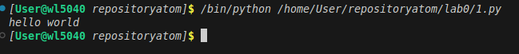

# Отчет
## Задание
вывести "Hello"
Описание проделанной работы
```
- Создали репозиторий для дисциплины на GitHub.
- Склонировали его себе на ПК.
- Написали свою первую программу.
- Запустили её.
- Сделали коммит и пуш.
```

## список использованных источников:

1. [статья на доке](https://doka.guide/tools/markdown/)

