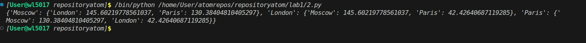
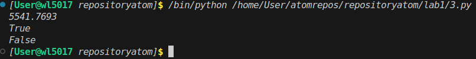
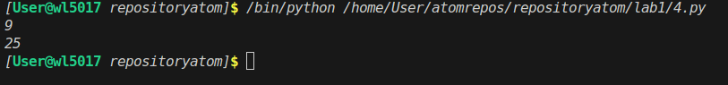
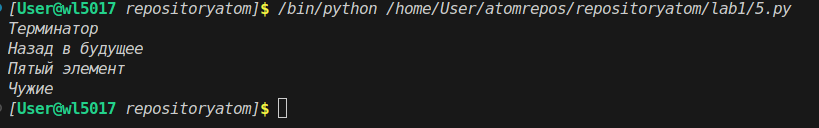
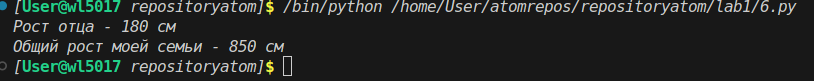
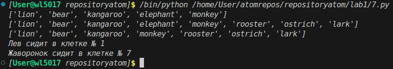
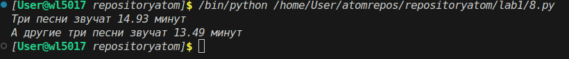
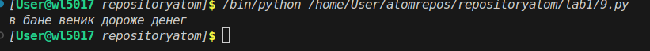
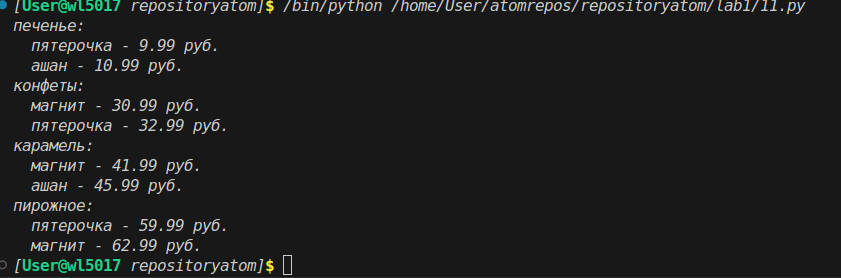
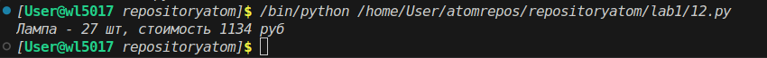

# ОТЧЕТ
## задание 2.py
Есть словарь координат городов
```
sites = {
    'Moscow': (550, 370),
    'London': (510, 510),
    'Paris': (480, 480),
}
```
# Составим словарь словарей расстояний между ними
# расстояние на координатной сетке - ((x1 - x2) ** 2 + (y1 - y2) ** 2) ** 0.5

Как делать?
Основная идея
1. сначала здесь стоит увидеть формулу расстояния
2. Создаём пустой словарь distances = {}
3. внешний цикл, берем за начало отсчета city1
4. создаем вложнный словарь для этого города
5. внутренний цикл создаем для других городов
6. проверяем, чтобы города не совпадали коорднатами, иначе пропуск
7. достаем координаты из sites(), считаем расстояние

## задание 3.py

Как делать?
Основная идея
1. формула площади пиэрквадрат
2. считаем площадь с помощью соответствующей формулы
3. проверяем, лежит тока вне или внутри окружности
4. если расстяние до центра меньше радиуса - точка внутри, иначе - снаружи

## задание 4.py

Как делать?
Основная идея
1. расставляем знаки таким образом, чтобы в результате получилось 25
2. python позволяет выполнять математические операции с помощью математических знаков

## задание 5.py

Как делать?
Основная идея
1. индексация строки - это возможность обратиться к любому символу строки с помощью соотвтествующего номера.
2. счет начинается с 0
3. [0:10] с помощью данной конструкции выводим фильмы

## задание 6.py

Как делать?
Основная идея
1. похожий принцип, только теперь нужно еще воспользоваться операцией сложения

## задание 7.py

Что требуется?
1. Посадить медведя между львом и кенгуру insert()
2. Добавить птиц в конец зоопарка extend()
3. Убрать слона remove()
4. Найти номера клеток льва и жаворонка index() + 1

Как делать?
Основная идея
1. чтобы всавить медведя между ьвом и кенгуру, нужно выбрать соответсвющую позицию в списке, т.е. 1
2. insert() вставка элемента "zoo.insert(1, 'bear')"
3. extend() добавление списка "zoo.extend(birds)"
4. отличие от append в том, что он добавляет список внутрь списка

## задание 8.py

Как делать?
Основная идея
1. задача показыват отличие списка от словаря
2. в словаре применяется другой контекст, т.е нужно указывать полное название элемента

## задание 9.py

Как делать?
Основная идея
1. нужно использовать срезы
2. просто берем и по аналогии с индексацией делаем срезы вот таким видом [9:3]

## задание 10.py

Как делать?
Основная идея
1. мы берем данные, сортируем их  по категориям и цене
2. чтобы вручную не искать и было проще, далее мы сортируем их по категориям и для проверки используем кнострукции указанные в коде

## задание 11.py

Как делать?
Основная идея
1. пройтись циклом по словарю goods (получаем имя товара и его код).
2. по коду найти список партий в словаре store.
3. создать переменные-счетчики: total_quantity (всего штук) и total_cost (общая стоимость), изначально равные 0.
4. пройтись циклом по списку партий этого товара:
5. прибавить количество из текущей партии к total_quantity.
6. посчитать стоимость текущей партии (quantity * price) и прибавить к total_cost.


# Medium

## Архитектура

Для корректного импортирования и изоляции логики была выбрана архитектура Python Package.

project_root/
│
├── package/                  # Верхнеуровневый пакет
│   ├── __init__.py           # Точка входа, экспортирует API
│   ├── distance_00.py        # Модуль задания 0
│   ├── circle_01.py          # Модуль задания 1
│   ├── my_family_04.py       # Модуль задания 4
│   ├── zoo_05.py             # Модуль задания 5
│   ├── songs_list_06.py      # Модуль задания 6
│   ├── secret_07.py          # Модуль задания 7
│   ├── garden_08.py          # Модуль задания 8
│   ├── shopping_09.py        # Модуль задания 9
│   └── store_10.py           # Модуль задания 10
│
└── tests/                    # Директория с тестами
    └── test_package.py       # Файл с тестами pytest

```
    from .distance_00 import distance
from .circle_01 import square, inCircle
from .my_family_04 import height_father, sum_height
from .zoo_05 import add_birds, find_animal
from .songs_list_06 import sum_3_songs_list, sum_3_songs_dict
from .secret_07 import decode
from .garden_08 import all_types, grow_everywhere, only_garden, only_meadow
from .shopping_09 import store_2_with_min_prices
from .store_10 import table_cost, sofa_cost, chair_cost

# Опционально: определение __all__ для явного указания публичного API
__all__ = [
    'distance',
    'square', 'inCircle',
    'height_father', 'sum_height',
    'add_birds', 'find_animal',
    'sum_3_songs_list', 'sum_3_songs_dict',
    'decode',
    'all_types', 'grow_everywhere', 'only_garden', 'only_meadow',
    'store_2_with_min_prices',
    'table_cost', 'sofa_cost', 'chair_cost'
]
```

# Well-done
## Тестирование (Pytest)
Тесты покрывают нормальные значения, ноль и недопустимые входные данные.
```
def test_square():
    # Проверка точности вычислений с плавающей точкой
    assert package.square(42) == 5541.7693
    assert package.square(1) == 3.1416
    assert package.square(2) == 12.5664

def test_square_zero():
    # Граничный случай: радиус 0
    assert package.square(0) == 0

def test_square_negative():
    # Негативный сценарий: отрицательный радиус должен возвращать None
    assert package.square(-5) is None
```

# Заключение
Реализованная структура позволяет легко расширять проект новыми задачами. Для добавления нового задания достаточно:
Создать новый файл .py в папке package.
Написать логику функции.
Добавить импорт этой функции в package/__init__.py.
Написать соответствующие тесты в папке tests.


