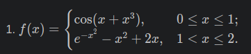
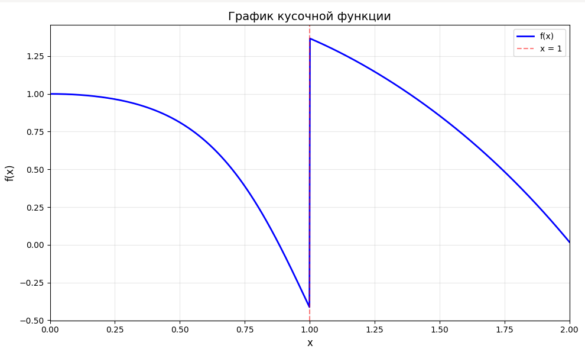

# Отчет

## Графики с учебника matplotlib 1.1 - 3.29

**1.1**


**1.3**


**1.4**


**1.5**


**1.6**


**1.7**


**1.8**


**2.1**


**2.2**


**2.3**


**2.4**


**2.5**


**2.6**


**2.7**


**2.8**


**2.9**


**2.10**


**2.10.1**


**2.11**


**3.1**


**3.2**


**3.3**


**3.4**


**3.5**


**3.6**


**3.7**


**3.8**


**3.9**


**3.10**


**3.11**


**3.12**


**3.13**


**3.14**


**3.15**


**3.16**


**3.17**


**3.18**


**3.19**


**3.20**


**3.21**


**3.22**


**3.23**


**3.23.1**


**3.24**


**3.25**


**3.26**


**3.27**


**3.28**


**3.29**


# Отчет

# Задание Вариант 1

## 1. Описание проделанной работы:
1. Я импортировал библиотеки matplotlib и numpy
2. Изучил уроки по построению графика
3. Создал график:
 на промежутке 0<=x<=1
## 2. Программа
```python
import numpy as np
import matplotlib.pyplot as plt

# определение кусочной функции
def f(x):
    result = np.zeros_like(x)
    
    # первая часть: cos(x + x^3) и 0 <= x <= 1
    mask1 = (x >= 0) & (x <= 1)
    result[mask1] = np.cos(x[mask1] + x[mask1]**3)
    
    # вторая часть: e^(-x^2) - x^2 + 2x и 1 < x <= 2
    mask2 = (x > 1) & (x <= 2)
    result[mask2] = np.exp(-x[mask2]**2) - x[mask2]**2 + 2*x[mask2]
    
    return result

# Создание массива значений x
x = np.linspace(0, 2, 1000)
y = f(x)

# Построение графика
plt.figure(figsize=(10, 6))
plt.plot(x, y, 'b-', linewidth=2, label='f(x)')

# Добавление точки разрыва (x = 1)
plt.axvline(x=1, color='r', linestyle='--', alpha=0.5, label='x = 1')

# Оформление графика
plt.xlabel('x', fontsize=12)
plt.ylabel('f(x)', fontsize=12)
plt.title('График кусочной функции', fontsize=14)
plt.legend()
plt.grid(True, alpha=0.3)
plt.xlim(0, 2)

# Показ графика
plt.tight_layout()
plt.show()
```
## 3. Вывод


## Список использованных источников

1. [NumPy documentation — numpy.where](https://numpy.org/doc/stable/reference/generated/numpy.where.html)
2. [Matplotlib documentation](https://matplotlib.org/stable/contents.html)
3. [Matplotlib cheatsheets and handouts](https://matplotlib.org/cheatsheets/)
4. [Markdown Cheat Sheet](https://www.markdownguide.org/cheat-sheet/)
5. [Writing mathematical expressions on GitHub](https://docs.github.com/en/get-started/writing-on-github/working-with-advanced-formatting/writing-mathematical-expressions)

# medium
Применены современные стили оформления
Обеспечена читаемость и информативность графиков
# well-done
Создан интерактивный график функции №3 в Plotly
Реализован экспорт в HTML с подключением через CDN
Обеспечена возможность публикации по ссылке