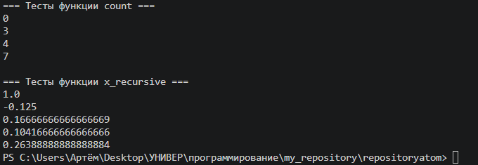

# Вариант 1

## Условия задач

**Задача 1.** 

**Задача 2.

## Описание проделанной работы

Каждая задача решена двумя способами: **с рекурсией** и **без**

### Задача 1 - Функция для подсчёта числа элементов в списках, включая вложенные списки
```
>>> count([])
0
>>> count([1, 2, 3])
3
>>> count(["x", "y", ["z"]])
4
>>> count([1, 2, [3, 4, [5]]])
7
```
решение с помошью стандартного определения рекурсии, где функция вызывает саму себя и с помощью стека, которым мы сами управляем и он не перегружается

### Задача 2 - Функция для расчёта
```
((n-1)*x(n-1))/3 + ((n-2)*x(n-2))/4
```
решение с помошью стандартного определения рекурсии, где функция вызывает саму себя и с помощью декоратора @lru_cache позволяет избежать повторных вычислений одних и тех же значений, превращая экспоненциальную сложность в линейную. Однако сами вызовы функций остаются дорогостоящими.
## Результат
Для каждой из задач был произведен тест с помощью pytest



## Список использованных источников

1. [Python Docs - Recursion and stack frames](https://docs.python.org/3/reference/executionmodel.html)
2. [Writing mathematical expressions](https://docs.github.com/en/get-started/writing-on-github/working-with-advanced-formatting/writing-mathematical-expressions)
3. [Real Python - Recursion in Python](https://realpython.com/python-recursion/)