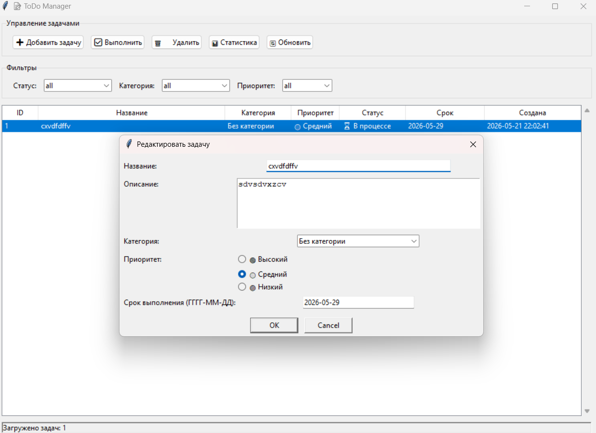
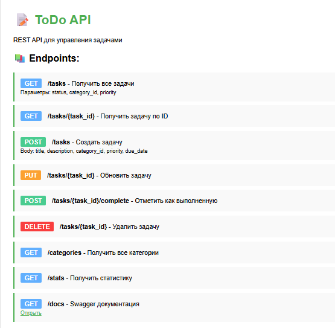

# Лабораторная работа №8: TODO Менеджер
## Нужно Реализовать консольный менеджер задач (TODO-лист) с возможностью:
1. Добавления задач
2. Удаления задач
3. Отметки выполнения задачи
4. Просмотра списка задач
### rare 
Я создал класс
```
class Task:
    def __init__(self, title: str, priority: str = "medium", tags: list = None):
        self.id = None
        self.title = title
        self.completed = False
        self.priority = priority
        self.tags = tags or []
        self.created_at = datetime.now()
```
сразу видно, какие поля обязательны, а какие нет.
легко добавить новое поле
менеджер «помнит» список задач (self.tasks). Если бы это были функции, пришлось бы передавать список обратно и назад.

# medium
Я выбрал SQLite т.к он встроен в Python и его качества
1. Производительность (Быстрый поиск, индексы)
2. Структурированность (Таблицы, типы данных)
3. Надёжность (можно делать сложные запросы)

## в SQLiteStorage используется полная перезапись таблицы
```
cursor.execute("DELETE FROM tasks")  # Удаляем всё
for task in tasks:
    cursor.execute("INSERT INTO tasks (...) VALUES (...)")
```
### не нужно отслеживать, какая задача изменилась, какая добавилась, какая удалилась.
### гарантия, что в БД точно то же состояние, что и в памяти.

# well done
## Tkinter был выбран потому что
1. Встроен в Python — не нужно ничего устанавливать.
2. Простой синтаксис — быстро сделать прототип.
3. Легко понять новичку — минимальный порог входа.
4. Достаточно для учебного проекта — кнопки, списки, поля ввода есть.

## Web-API на FastAPI
1. Автоматическая документация Swagger UI.
2. Валидация данных через Pydantic — меньше багов.
3. Асинхронность — быстрее обрабатывает запросы.
4. Современный стандарт

## в API используется глобальный экземпляр manager
```
manager = TodoManager()
manager.load_from_db()

@app.get("/tasks")
def get_all_tasks():
    return manager.get_all_tasks()
```
### Просто и понятно, работает корректно, пока сервер запущен в одном процессе.


# вывод
## В ходе выполнения итоговой лабораторной работы №8 был разработан полнофункциональный менеджер задач TaskMaster Pro, реализующий принципы модульного программирования, работы с базами данных и создания веб-интерфейсов на языке Python.

### Проект обладает потенциалом для масштабирования. Направления улучшения:
1. Замена глобального состояния в API на Dependency Injection.
2. Добавление асинхронности в работу с БД для повышения производительности Web-сервера.
3. Реализация пользовательской авторизации и разграничения прав доступа.
4. Переход на более продвинутый GUI-фреймворк (PyQt6 или Kivy) для улучшения визуального стиля.
5. Контейнеризация приложения с помощью Docker для упрощения развёртывания.

# скриншоты



# Используемые материалы и ссылки

[Документация Python Tkinter](https://docs.python.org/3/library/tkinter.html?spm=a2ty_o01.29997173.0.0.163655fbEPZWGV)
[Документация SQLite](https://www.sqlite.org/docs.html?spm=a2ty_o01.29997173.0.0.163655fbEPZWGV)
[FastAPI Official] Documentation(https://fastapi.tiangolo.com/?spm=a2ty_o01.29997173.0.0.163655fbEPZWGV)
[Pydantic Models](https://docs.pydantic.dev/latest/?spm=a2ty_o01.29997173.0.0.163655fbEPZWGV)
[Real Python:] Building a To-Do App(https://realpython.com/python-todo-list-app/?spm=a2ty_o01.29997173.0.0.163655fbEPZWGV)
